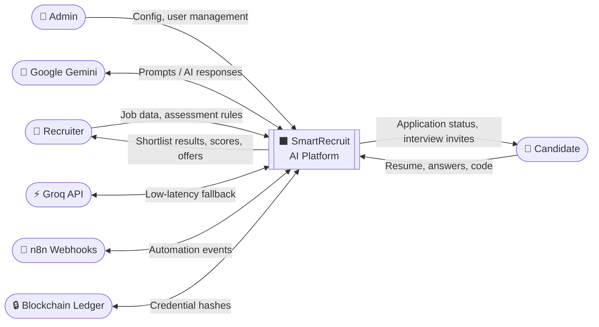
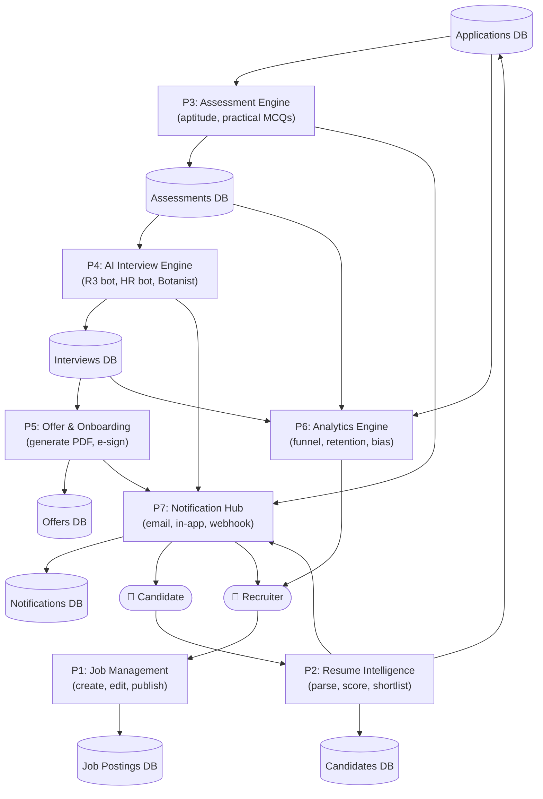
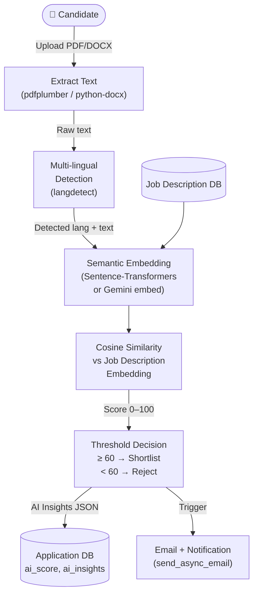
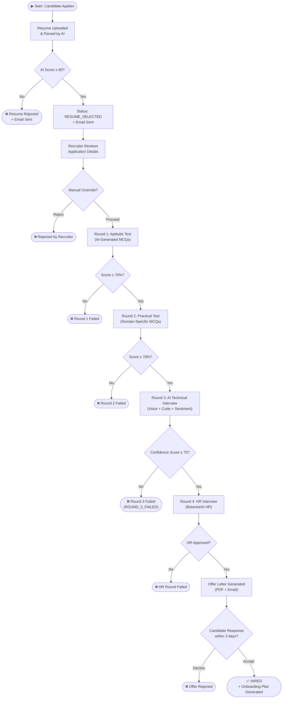
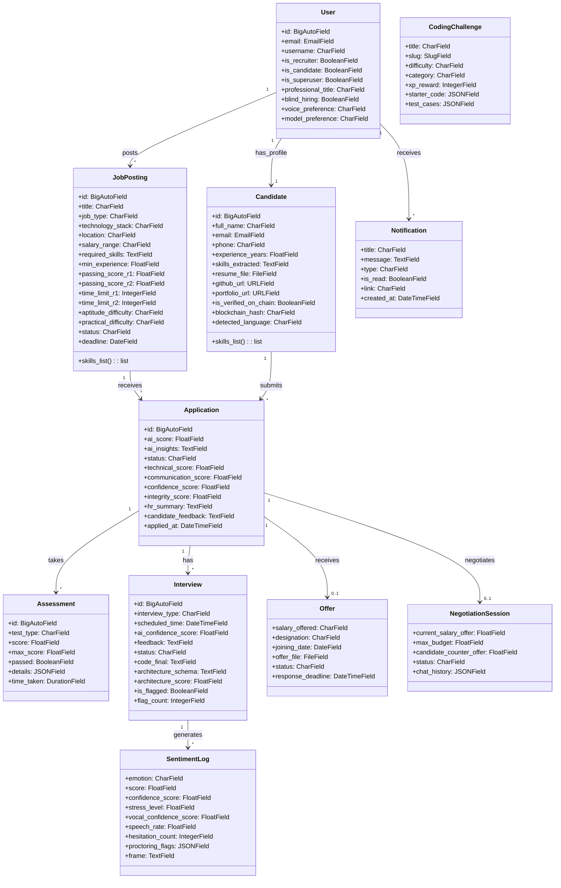
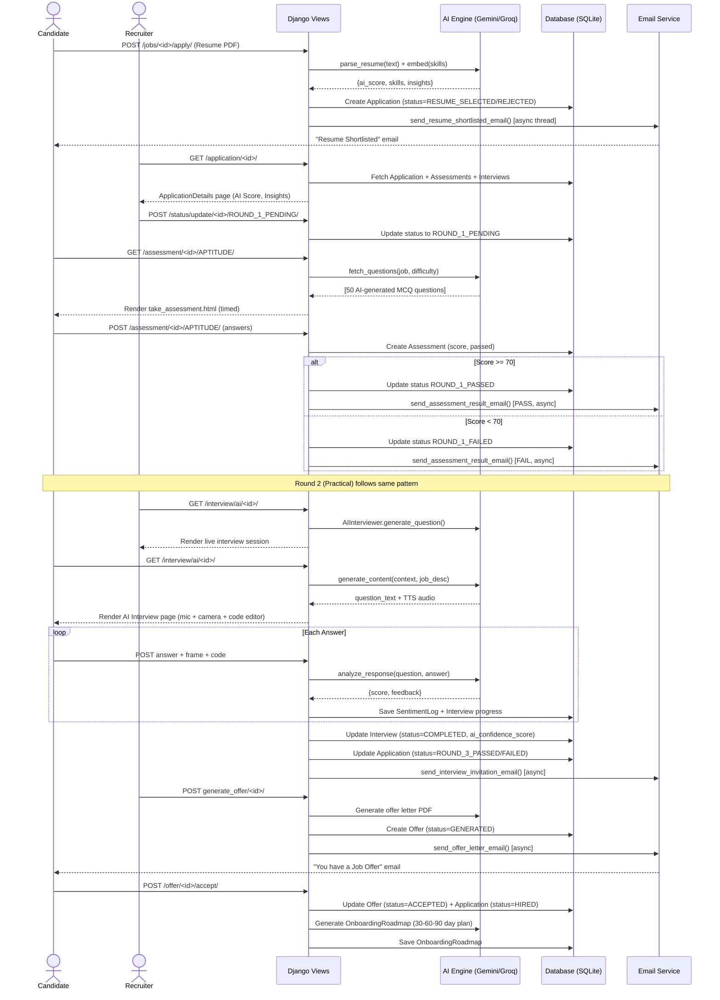

# SmartRecruit — Complete UML Diagrams (System-Analyzed)
> Auto-generated from codebase analysis — March 2026

---

## 1. USE CASE DIAGRAM

```mermaid
graph TD
    subgraph SmartRecruit_System["SmartRecruit AI Recruitment Platform"]
        UC1["Post Job Opening"]
        UC2["Generate JD with AI"]
        UC3["View All Applications"]
        UC4["Shortlist / Reject Resume"]
        UC5["Schedule Assessment"]
        UC6["Preview AI Assessment"]
        UC7["Launch AI Interview (R3)"]
        UC8["Launch HR Interview (R4)"]
        UC9["Launch Botanist Voice Interview"]
        UC10["Live Code Session with Candidate"]
        UC11["Generate Offer Letter"]
        UC12["Send Broadcast Notification"]
        UC13["View Analytics Dashboard"]
        UC14["Manage Platform Settings"]
        UC15["Blind Hiring Mode"]
        UC16["Kanban Pipeline View"]
        UC17["Coding Arena Management"]
        UC18["View Recruiter Performance"]
        UC19["Manage Users"]
        UC20["Biometric Proctoring"]
        UC21["Register Account"]
        UC22["Login / SSO"]
        UC23["Apply for Job"]
        UC24["Take Aptitude Test (R1)"]
        UC25["Take Practical Test (R2)"]
        UC26["Attend AI Interview (R3)"]
        UC27["View / Accept Offer"]
        UC28["Track Application Status"]
        UC29["Use AI Prep Lab"]
        UC30["Solve Coding Challenges"]
        UC31["Build Resume with AI"]
        UC32["Score Cover Letter"]
        UC33["Verify Credentials (Blockchain)"]
    end

    Recruiter["👤 Recruiter"]
    Candidate["👤 Candidate"]
    Admin["👤 Admin"]

    Recruiter -->|performs| UC1
    Recruiter -->|performs| UC2
    Recruiter -->|performs| UC3
    Recruiter -->|performs| UC4
    Recruiter -->|performs| UC5
    Recruiter -->|performs| UC6
    Recruiter -->|performs| UC7
    Recruiter -->|performs| UC8
    Recruiter -->|performs| UC9
    Recruiter -->|performs| UC10
    Recruiter -->|performs| UC11
    Recruiter -->|performs| UC15
    Recruiter -->|performs| UC16
    Recruiter -->|performs| UC20

    Candidate -->|performs| UC21
    Candidate -->|performs| UC22
    Candidate -->|performs| UC23
    Candidate -->|performs| UC24
    Candidate -->|performs| UC25
    Candidate -->|performs| UC26
    Candidate -->|performs| UC27
    Candidate -->|performs| UC28
    Candidate -->|performs| UC29
    Candidate -->|performs| UC30
    Candidate -->|performs| UC31
    Candidate -->|performs| UC32
    Candidate -->|performs| UC33

    Admin -->|manages| UC12
    Admin -->|manages| UC13
    Admin -->|manages| UC14
    Admin -->|manages| UC17
    Admin -->|manages| UC18
    Admin -->|manages| UC19
    Admin -->|performs| UC22
```

---

## 2. DATA FLOW DIAGRAM — Level 0 (Context Diagram)

---

## 3. DATA FLOW DIAGRAM — Level 1 (Major Processes)

---

## 4. DATA FLOW DIAGRAM — Level 2 (Resume Screening Process)

---

## 5. ACTIVITY DIAGRAM — Full 4-Round Hiring Pipeline

---

## 6. CLASS DIAGRAM — Core Data Models

---

## 7. SEQUENCE DIAGRAM — End-to-End Hiring Flow

