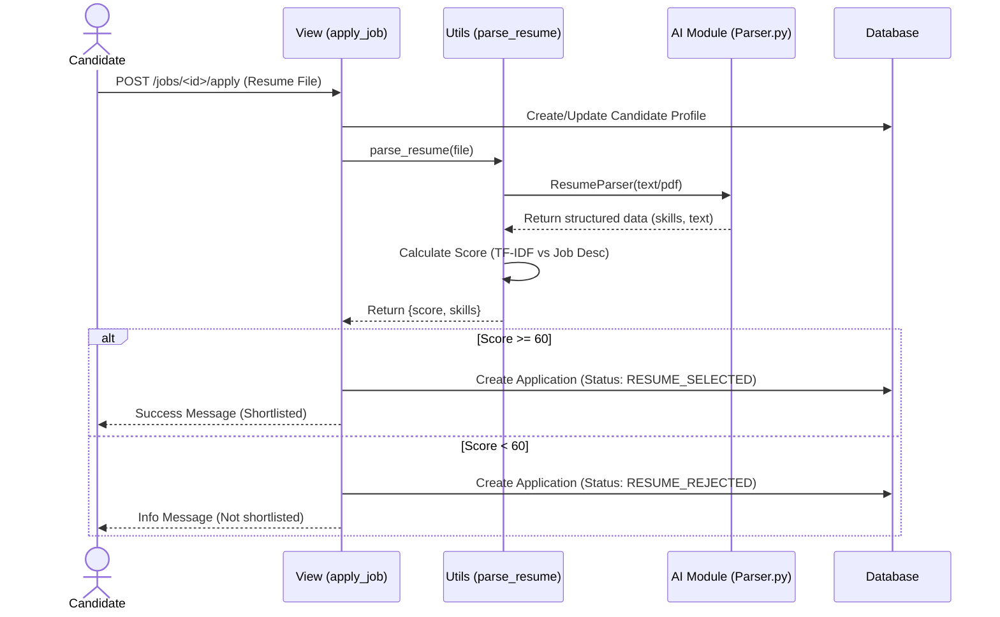
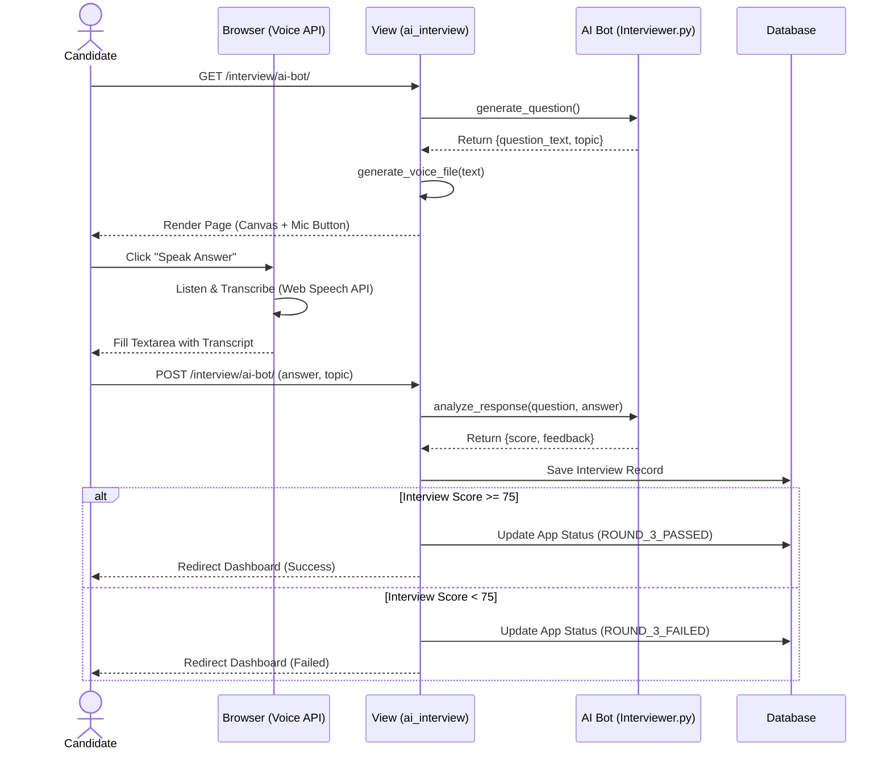
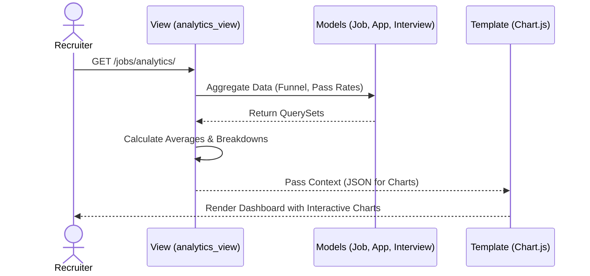

# Sequence Diagrams

## 1. Job Application & Resume Parsing Flow

```mermaid
sequenceDiagram
    actor C as Candidate
    participant V as View (apply_job)
    participant U as Utils (parse_resume)
    participant A as AI Module (Parser.py)
    participant D as Database

    C->>V: POST /jobs/<id>/apply (Resume File)
    V->>D: Create/Update Candidate Profile
    V->>U: parse_resume(file)
    U->>A: ResumeParser(text/pdf)
    A-->>U: Return structured data (skills, text)
    U->>U: Calculate Score (TF-IDF vs Job Desc)
    U-->>V: Return {score, skills}
    
    alt Score >= 60
        V->>D: Create Application (Status: RESUME_SELECTED)
        V-->>C: Success Message (Shortlisted)
    else Score < 60
        V->>D: Create Application (Status: RESUME_REJECTED)
        V-->>C: Info Message (Not shortlisted)
    end
```

## 2. AI Technical Interview Flow with Speech-to-Text

```mermaid
sequenceDiagram
    actor C as Candidate
    participant B as Browser (Voice API)
    participant V as View (ai_interview)
    participant AI as AI Bot (Interviewer.py)
    participant D as Database

    C->>V: GET /interview/ai-bot/
    V->>AI: generate_question()
    AI-->>V: Return {question_text, topic}
    V->>V: generate_voice_file(text)
    V-->>C: Render Page (Canvas + Mic Button)

    C->>B: Click "Speak Answer"
    B->>B: Listen & Transcribe (Web Speech API)
    B-->>C: Fill Textarea with Transcript
    
    C->>V: POST /interview/ai-bot/ (answer, topic)
    
    V->>AI: analyze_response(question, answer)
    AI-->>V: Return {score, feedback}

    V->>D: Save Interview Record
    
    alt Interview Score >= 75
        V->>D: Update App Status (ROUND_3_PASSED)
        V-->>C: Redirect Dashboard (Success)
    else Interview Score < 75
        V->>D: Update App Status (ROUND_3_FAILED)
        V-->>C: Redirect Dashboard (Failed)
    end
```

## 3. Recruiter Analytics Dashboard Flow

```mermaid
sequenceDiagram
    actor R as Recruiter
    participant V as View (analytics_view)
    participant M as Models (Job, App, Interview)
    participant T as Template (Chart.js)

    R->>V: GET /jobs/analytics/
    V->>M: Aggregate Data (Funnel, Pass Rates)
    M-->>V: Return QuerySets
    V->>V: Calculate Averages & Breakdowns
    V-->>T: Pass Context (JSON for Charts)
    T-->>R: Render Dashboard with Interactive Charts
```
